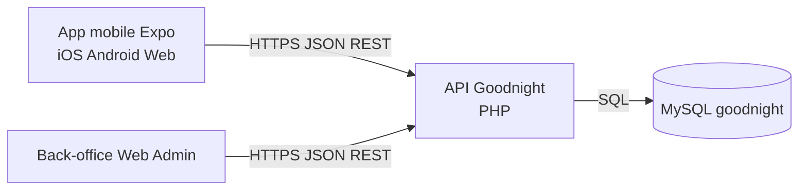

# Architecture globale Goodnight (mobile + back-office + BDD)

## Objectif BTS
Montrer que le systeme n'est pas un simple front autonome, mais une architecture client/serveur reelle avec plusieurs clients qui partagent la meme API et la meme base.

## Vue d'ensemble

## Principe cle
- L'app mobile et le back-office administrateur ne parlent jamais directement a la base.
- Les deux passent par la meme API.
- Les regles de securite et de validation sont centralisees cote API:
  - authentification JWT
  - autorisation par ownership/role
  - validations metier (dates, conflits, statut)
  - controles uploads

## Benefices techniques
- Cohesion des regles metier: une seule source de verite.
- Securite homogene: meme controle pour tous les clients.
- Evolutivite: ajout d'un nouveau client (ex. desktop) sans changer la BDD.
- Maintenabilite: couche API testable independamment des interfaces.

## Exemple concret a presenter a l'oral
Reservation:
1. Mobile envoie POST /reservations.
2. API verifie JWT, ownership, conflits de dates, statut du bien.
3. API ecrit en BDD puis cree la notification.
4. Le back-office voit la reservation via ses propres ecrans en lisant la meme source de donnees.

## Message fort jury
Deux clients differents (mobile utilisateur et web admin) exploitent la meme API et la meme BDD. Les decisions de securite sont cote serveur et s'appliquent automatiquement aux deux.
