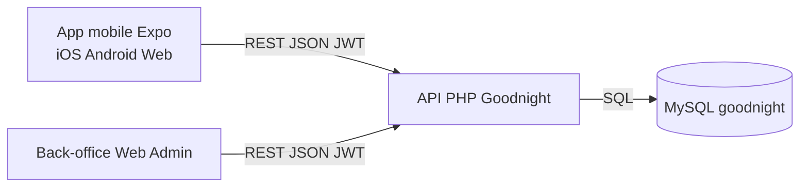

# Dossier de soutenance BTS - Projet Goodnight

## 1. Contexte et objectif
Goodnight est une application de location saisonniere avec deux clients distincts:
- client mobile/web utilisateur (Expo React Native)
- client web back-office (administration)

Les deux clients partagent:
- la meme API (PHP)
- la meme base MySQL

Objectif du projet:
- permettre la consultation, reservation et gestion de biens
- garantir la coherence metier et la securite via une API centrale

## 2. Perimetre fonctionnel
### Cote locataire
- inscription, connexion, persistance de session
- recherche de biens avec filtres avances
- detail d'un bien
- gestion des favoris
- reservations (creer, consulter, annuler)
- notifications

### Cote proprietaire
- ajouter/modifier ses biens
- gerer les photos (upload, suppression, photo principale)
- gerer les blocages calendrier
- suivre le statut de validation des annonces
- traiter les reservations recues (confirmer/refuser)

### Cote administration (back-office)
- valider/refuser les annonces
- ajouter un motif de refus
- appliquer des regles metier communes a tous les clients

## 3. Architecture globale
L'architecture est client/serveur multi-clients.

Points cles:
- aucune logique metier sensible dans l'interface uniquement
- securite centralisee cote API
- reutilisation des memes donnees pour mobile et back-office

## 4. Choix techniques
- Front: React Native + Expo + TypeScript
- Navigation: React Navigation (tabs + stacks)
- Backend: API PHP routee
- Base de donnees: MySQL
- Authentification: JWT Bearer
- Stockage session: SecureStore mobile, localStorage web

## 5. Qualite logicielle et architecture front
### 5.1 Typage fort TypeScript
Mise en place d'un typage fort des reponses API:
- type unifie ApiResponse<T>
- client HTTP generique fetchApi<T>
- types partages User/Bien/Reservation

Valeur BTS:
- reduction des erreurs runtime
- meilleure lisibilite des contrats API
- architecture plus maintenable

### 5.2 Roles discriminants
Role modele avec union type:
- visiteur | locataire | proprietaire | admin

Contexte auth type:
- role explicite
- hasRole(...)
- etat visiteur/authentifie discrimine

### 5.3 Separation logique/UI
Couche services API par endpoint + hooks metier:
- useBiens
- useReservations

Valeur BTS:
- architecture en couches
- facilite les tests et la maintenance

### 5.4 Routes protegees declaratives
Composants:
- RequireAuth
- RequireRole

Usage:
- blocage automatique des ecrans proteges
- protection specifique proprietaire/admin pour certaines routes

### 5.5 Error Boundary global
Ajout d'un AppErrorBoundary a la racine:
- evite le crash complet de l'application
- permet une reprise via bouton Reessayer

## 6. Securite (API et coherence front)
### 6.1 Authentification
- token JWT requis sur routes protegees
- verification du token via middleware
- expiration et invalidation de session gerees

### 6.2 Autorisation
- controle ownership serveur (un proprietaire agit uniquement sur ses biens)
- refus si role/ownership non autorise
- protection front coherente via RequireRole

### 6.3 Validation metier
- prevention conflits reservation (chevauchement)
- validations des champs critiques
- controle uploads image (taille/type)

### 6.4 Reduction du risque
- requetes preparees SQL
- isolation des donnees par utilisateur
- invalidation session en cas de 401

## 7. Strategie cache et synchronisation
- persistance de session locale
- rafraichissement au focus des ecrans
- polling intelligent sans perturber la navigation
- badge des nouveaux elements avant recharge explicite

Voir document dedie:
- STRATEGIE_CACHE_ET_SYNCHRO.md

## 8. Difficultes rencontrees et solutions
### Probleme
- incoherences session entre plateforme mobile/web
- rechargements redondants sur navigation
- risque de routes accessibles sans role explicite

### Solutions
- centralisation auth dans useAuth
- hook useScreenFocus + polling maitrise
- RequireAuth/RequireRole declaratifs
- contrats API types et generiques

## 9. Resultats obtenus
- application plus robuste
- meilleure securite front + back
- base de code plus claire pour evolutions futures
- argumentaire technique fort pour le jury BTS

## 10. Axes d'amelioration
- migration cache vers TanStack Query
- suite de tests (Vitest + React Testing Library)
- observabilite (logs/erreurs centralises)
- enrichissement du back-office admin

## 11. Conclusion soutenance
Le projet demontre une architecture complete et realiste:
- plusieurs clients
- une API commune
- une base partagée
- securite et regles metier centralisees

C'est une implementation coherente de systeme d'information, au-dela d'une simple application front.

## Annexes (documents a presenter)
- ARCHITECTURE_GLOBALE_APP_API_BDD.md
- STRATEGIE_CACHE_ET_SYNCHRO.md
- SPEC_FONCTIONNELLE.md
- SPEC_TECHNIQUE.md
